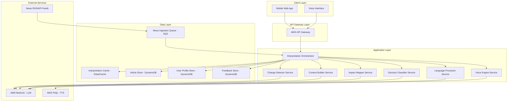

# Design Document:  WhyItMatters

## Overview
WhyItMatters is aNews Interpreter System that is an AWS-based platform that transforms traditional news consumption by interpreting meaning, context, and personal impact rather than summarizing content.

### Core Philosophy

```
Traditional News:  Event → Summary → Reader figures it out
                   
Our Approach:      Event → Interpretation → Clear Understanding
                          (Change + Context + Impact)
```

### Key Differentiators

| Traditional News | News Interpreter |
|-----------------|------------------|
| Summarizes content | Interprets meaning |
| Assumes knowledge | Builds context |
| Reports events | Explains consequences |
| Generic information | Personally relevant |

### System Goals

1. **Accessibility**: Voice interfaces, simple language, low literacy support
2. **Personalization**: Demographic-specific impact analysis
3. **Efficiency**: 30-second mode for time-constrained users
4. **Scalability**: AWS serverless architecture for 10,000+ concurrent users
5. **Multi-language**: English + Indian languages

## Architecture

### Design Principles

- **Microservices**: Each interpretation component is an independent service
- **Serverless**: AWS Lambda for auto-scaling and cost efficiency
- **Event-Driven**: SQS queues for asynchronous processing
- **Cache-First**: ElastiCache for fast repeated access
- **Mobile-Optimized**: CloudFront CDN for global low-latency delivery

### High-Level Architecture



### Component Responsibilities

#### 🎯 Interpretation Orchestrator
**Role**: Central coordinator for the interpretation pipeline

- Manages workflow across all services
- Implements caching strategy
- Handles user profile retrieval
- Provides rate limiting and load balancing

#### 🔄 Change Detector Service
**Role**: Identifies temporal changes in news

- Analyzes before/now/after states
- Uses LLM with structured prompts
- Handles multiple changes per article
- Structures output in standardized format

#### 📚 Context Builder Service
**Role**: Adds essential background information

- Identifies entities requiring explanation
- Generates concise context using LLM
- Simplifies jargon and technical terms
- Prioritizes based on user demographics

#### 👥 Impact Mapper Service
**Role**: Analyzes demographic-specific impacts

- Evaluates impact on 4 demographic groups
- Generates concrete, relatable descriptions
- Identifies regional variations
- Prioritizes user's demographic

#### 🎯 Decision Classifier Service
**Role**: Categorizes news for action

- Classifies as Ignore/Monitor/Take Action
- Generates action recommendations
- Provides monitoring guidance
- Bases decisions on user profile

#### 🌐 Language Processor Service
**Role**: Multi-language translation

- Translates to target languages
- Maintains simplicity across languages
- Preserves interpretation structure
- Manages language preferences

#### 🔊 Voice Engine Service
**Role**: Text-to-speech conversion

- Converts text to natural speech (AWS Polly)
- Manages voice selection per language
- Implements playback controls
- Optimizes for mobile delivery

### AWS Service Mapping

| Purpose | AWS Service | Usage |
|---------|-------------|-------|
| **Compute** | AWS Lambda | All microservices (serverless, auto-scaling) |
| **API Management** | API Gateway | REST API, rate limiting, authentication |
| **LLM** | AWS Bedrock | Claude/similar for interpretation generation |
| **Text-to-Speech** | AWS Polly | Voice synthesis in multiple languages |
| **Caching** | ElastiCache | Redis for interpretation caching |
| **Database** | DynamoDB | Articles, user profiles, feedback storage |
| **Queue** | SQS | News ingestion queue |
| **Storage** | S3 | Audio files, static assets |
| **CDN** | CloudFront | Content delivery, mobile optimization |
| **Monitoring** | CloudWatch | Logging, metrics, alarms |

### Data Flow

```
1. News Ingestion:
   RSS/API → SQS Queue → Lambda → DynamoDB

2. Interpretation Generation:
   User Request → API Gateway → Orchestrator
   → Check Cache (ElastiCache)
   → If miss: Parallel processing
      ├─ Change Detector → Bedrock
      ├─ Context Builder → Bedrock
      ├─ Impact Mapper → Bedrock
      └─ Decision Classifier → Bedrock
   → Combine results → Cache → Return

3. Voice Generation:
   Interpretation → Voice Engine → Polly
   → S3 → CloudFront → User

4. Multi-language:
   Interpretation → Language Processor → Bedrock
   → Translated interpretation → Cache → Return
```

## Components and Interfaces

### Interpretation Orchestrator

**Interface:**
```typescript
interface InterpretationOrchestrator {
  // Generate interpretation for a news article
  interpretArticle(
    articleId: string,
    userId?: string,
    mode?: '30-second' | 'full'
  ): Promise<Interpretation>
  
  // Retrieve cached interpretation
  getCachedInterpretation(
    articleId: string,
    userId?: string
  ): Promise<Interpretation | null>
  
  // Process news from ingestion queue
  processNewsQueue(): Promise<void>
}
```

**Responsibilities:**
- Orchestrate the interpretation pipeline
- Manage caching and cache invalidation
- Apply user preferences and demographic filtering
- Handle errors and fallback strategies

### Change Detector Service

**Interface:**
```typescript
interface ChangeDetectorService {
  // Detect changes in a news article
  detectChanges(article: NewsArticle): Promise<ChangeAnalysis>
}

interface ChangeAnalysis {
  changes: Change[]
  confidence: number
}

interface Change {
  before: string
  now: string
  after: string
  category: string // policy, economic, social, political, etc.
}
```

**Implementation Strategy:**
- Use LLM with structured prompts to extract temporal information
- Parse article for temporal markers (dates, "previously", "now", etc.)
- Infer before state when not explicitly stated
- Separate multiple changes into distinct Change objects

### Context Builder Service

**Interface:**
```typescript
interface ContextBuilderService {
  // Build context for a news article
  buildContext(
    article: NewsArticle,
    changes: Change[],
    userProfile?: DemographicProfile
  ): Promise<ContextInfo>
}

interface ContextInfo {
  entities: EntityContext[]
  backgroundInfo: string
  simplifiedTerms: Map<string, string>
}

interface EntityContext {
  entity: string
  explanation: string
  relevance: number
}
```

**Implementation Strategy:**
- Extract named entities and technical terms from article
- Query LLM for concise explanations of unfamiliar concepts
- Prioritize context based on user demographic profile
- Limit context to essential information (max 3-4 key points)

### Impact Mapper Service

**Interface:**
```typescript
interface ImpactMapperService {
  // Map impacts to demographic groups
  mapImpacts(
    article: NewsArticle,
    changes: Change[],
    context: ContextInfo
  ): Promise<ImpactAnalysis>
}

interface ImpactAnalysis {
  impacts: DemographicImpact[]
  primaryImpact: DemographicImpact
}

interface DemographicImpact {
  demographic: 'student' | 'salaried' | 'business' | 'rural'
  impact: string
  severity: 'none' | 'low' | 'medium' | 'high'
  timeframe: string
  regionalVariations?: RegionalImpact[]
}

interface RegionalImpact {
  region: string
  specificImpact: string
}
```

**Implementation Strategy:**
- Use LLM to analyze impact on each demographic group
- Generate concrete, relatable impact descriptions
- Identify primary impact based on user profile
- Detect regional and income-level variations

### Decision Classifier Service

**Interface:**
```typescript
interface DecisionClassifierService {
  // Classify news for decision support
  classify(
    article: NewsArticle,
    impacts: ImpactAnalysis,
    userProfile?: DemographicProfile
  ): Promise<DecisionClassification>
}

interface DecisionClassification {
  category: 'ignore' | 'monitor' | 'take-action'
  reasoning: string
  actionRequired?: ActionRecommendation
  monitoringGuidance?: MonitoringGuidance
}

interface ActionRecommendation {
  action: string
  deadline: string
  priority: 'low' | 'medium' | 'high'
}

interface MonitoringGuidance {
  whatToWatch: string
  timeframe: string
  updateFrequency: string
}
```

**Implementation Strategy:**
- Use impact severity and user profile to determine classification
- Generate specific action recommendations with deadlines
- Provide monitoring guidance for "monitor" classification
- Explain reasoning for "ignore" classification

### Language Processor Service

**Interface:**
```typescript
interface LanguageProcessorService {
  // Translate interpretation to target language
  translate(
    interpretation: Interpretation,
    targetLanguage: string
  ): Promise<Interpretation>
  
  // Simplify language complexity
  simplify(text: string, targetLanguage: string): Promise<string>
}
```

**Implementation Strategy:**
- Use LLM for translation with simplicity constraints
- Maintain interpretation structure across languages
- Validate translation preserves meaning
- Support English and one Indian language initially (Hindi recommended)

### Voice Engine Service

**Interface:**
```typescript
interface VoiceEngineService {
  // Generate audio for interpretation
  generateAudio(
    text: string,
    language: string,
    voiceSettings?: VoiceSettings
  ): Promise<AudioResult>
}

interface VoiceSettings {
  speed: number // 0.5 to 2.0
  voice: string // voice ID for AWS Polly
}

interface AudioResult {
  audioUrl: string
  duration: number
  format: 'mp3' | 'ogg'
}
```

**Implementation Strategy:**
- Use AWS Polly for text-to-speech conversion
- Cache generated audio in S3 with CloudFront distribution
- Support speed adjustment (0.75x, 1x, 1.25x, 1.5x)
- Select appropriate voices for each language

## Data Models

### NewsArticle

```typescript
interface NewsArticle {
  id: string
  source: string
  url: string
  headline: string
  content: string
  publishedAt: Date
  ingestedAt: Date
  category: string
  language: string
  metadata: {
    author?: string
    tags?: string[]
    imageUrl?: string
  }
}
```

### Interpretation

```typescript
interface Interpretation {
  id: string
  articleId: string
  generatedAt: Date
  mode: '30-second' | 'full'
  language: string
  
  // Core interpretation components
  changes: Change[]
  context: ContextInfo
  impacts: ImpactAnalysis
  decision: DecisionClassification
  
  // Formatted output
  formattedText: string
  wordCount: number
  estimatedReadTime: number
  
  // Audio
  audioUrl?: string
  audioDuration?: number
  
  // Metadata
  sourceArticle: {
    headline: string
    source: string
    url: string
    publishedAt: Date
  }
}
```

### UserProfile

```typescript
interface UserProfile {
  id: string
  createdAt: Date
  lastActive: Date
  
  // Demographics
  demographic: 'student' | 'salaried' | 'business' | 'rural' | 'general'
  region?: string
  
  // Preferences
  preferredLanguage: string
  defaultMode: '30-second' | 'full'
  voiceEnabled: boolean
  voiceSettings: VoiceSettings
  
  // Usage tracking
  interpretationsViewed: number
  feedbackProvided: number
}
```

### Feedback

```typescript
interface Feedback {
  id: string
  interpretationId: string
  userId?: string
  submittedAt: Date
  
  helpful: boolean
  specificFeedback?: string
  category?: 'accuracy' | 'clarity' | 'relevance' | 'other'
}
```

### CacheEntry

```typescript
interface CacheEntry {
  key: string // articleId + userId + mode + language
  interpretation: Interpretation
  cachedAt: Date
  ttl: number // time to live in seconds
  hits: number
}
```


## Correctness Properties

> **What are Properties?**
> 
> A property is a characteristic or behavior that should hold true across all valid executions of a system—essentially, a formal statement about what the system should do. Properties serve as the bridge between human-readable specifications and machine-verifiable correctness guarantees.

### Property Categories

```
┌─────────────────────────────────────────────────────┐
│ Change Detection    → Structure, completeness       │
│ Decision Support    → Classification, completeness  │
│ Context Building    → Extraction, simplification    │
│ Impact Mapping      → Coverage, personalization     │
│ 30-Second Mode      → Word limits, content          │
│ Voice & Language    → Generation, translation       │
│ Data Management     → Persistence, caching          │
│ Quality Assurance   → Accuracy, citations           │
│ Performance         → Timing, scalability            │
└─────────────────────────────────────────────────────┘
```

---

### 🔄 Change Detection Properties

**Property 1: Complete change structure**
*For any* news article processed by the Change_Detector, the resulting ChangeAnalysis should contain at least one Change object with non-empty before, now, and after fields.
**Validates: Requirements 1.1**

**Property 2: Inference or unknown marking**
*For any* news article without an explicit before state, the Change_Detector should either infer a reasonable before state or mark it as "unknown" in the before field.
**Validates: Requirements 1.2**

**Property 3: Structured output format**
*For any* interpretation, the formattedText should contain the before/now/after structure in that specific order.
**Validates: Requirements 1.3**

**Property 4: Multiple change separation**
*For any* news article with N distinct changes, the Change_Detector should return exactly N Change objects with different categories or content.
**Validates: Requirements 1.4**

---

### 🎯 Decision Classification Properties

**Property 5: Valid classification category**
*For any* interpretation, the decision.category should be exactly one of: 'ignore', 'monitor', or 'take-action'.
**Validates: Requirements 2.1**

**Property 6: Classification completeness**
*For any* interpretation, the decision object should contain all required fields based on its category: actionRequired with action and deadline for 'take-action', monitoringGuidance with whatToWatch and timeframe for 'monitor', and non-empty reasoning for 'ignore'.
**Validates: Requirements 2.2, 2.3, 2.4**

**Property 7: Demographic-based classification**
*For any* news article, when interpreted with two different demographic profiles that have different impact severities, the decision classifications should differ if one has high severity and the other has none.
**Validates: Requirements 2.5**

---

### 📚 Context Building Properties

**Property 8: Entity context extraction**
*For any* news article containing named entities (people, organizations, policies), the ContextInfo should include EntityContext objects for at least the most prominent entities.
**Validates: Requirements 3.1**

**Property 9: Term simplification**
*For any* news article containing technical terms or jargon, the ContextInfo.simplifiedTerms map should contain entries for those terms with simpler explanations.
**Validates: Requirements 3.4**

---

### 👥 Impact Mapping Properties

**Property 10: Complete demographic coverage**
*For any* interpretation without a specific user profile, the ImpactAnalysis.impacts array should contain exactly four DemographicImpact objects covering: student, salaried, business, and rural demographics.
**Validates: Requirements 4.1, 9.5**

**Property 11: Primary impact alignment**
*For any* interpretation with a specified user demographic profile, the ImpactAnalysis.primaryImpact.demographic should match the user's demographic.
**Validates: Requirements 4.2**

**Property 12: Explicit no-impact statement**
*For any* DemographicImpact with severity 'none', the impact description should explicitly state that there is no significant impact or minimal impact.
**Validates: Requirements 4.3**

**Property 13: Regional variation specification**
*For any* DemographicImpact where impacts vary by region, the regionalVariations array should be non-empty and contain at least one RegionalImpact object.
**Validates: Requirements 4.5**

---

### ⚡ 30-Second Mode Properties

**Property 14: Word count limit**
*For any* interpretation generated in 30-second mode, the wordCount should be less than or equal to 150.
**Validates: Requirements 5.1**

**Property 15: Essential content inclusion**
*For any* interpretation in 30-second mode, the formattedText should contain references to all three core elements: change (before/now/after), decision classification, and primary impact.
**Validates: Requirements 5.2**

**Property 16: Reading time calculation**
*For any* interpretation, the estimatedReadTime (in minutes) should equal the ceiling of wordCount divided by 150.
**Validates: Requirements 5.5**

---

### 🔊 Voice Engine Properties

**Property 17: Audio generation success**
*For any* interpretation text and supported language, calling generateAudio should return an AudioResult with a valid non-empty audioUrl and positive duration.
**Validates: Requirements 6.1**

**Property 18: Performance - Audio generation time**
*For any* interpretation with 150 words or fewer, audio generation should complete within 5 seconds.
**Validates: Requirements 6.4**

---

### 🌐 Language Processing Properties

**Property 19: User preference persistence**
*For any* user profile, when the preferredLanguage, voiceSettings, or defaultMode is updated and the profile is retrieved again, the stored values should match the updated values.
**Validates: Requirements 7.4, 9.4**

**Property 20: Structure preservation across translation**
*For any* interpretation translated to another language, the translated version should preserve the presence of all major sections: changes, context, impacts, and decision classification.
**Validates: Requirements 7.5**

---

### 📥 News Ingestion Properties

**Property 21: Processing time limit**
*For any* news article added to the ingestion queue, the time from queue entry to interpretation completion should be less than or equal to 120 seconds under normal load.
**Validates: Requirements 8.2**

**Property 22: Spam and advertisement filtering**
*For any* content classified as spam or advertisement by validation rules, the News_Interpreter should reject it and not create an interpretation.
**Validates: Requirements 8.3**

**Property 23: Duplicate detection**
*For any* news article that is a duplicate or near-duplicate (>90% similarity) of an existing article, the News_Interpreter should detect it and skip creating a new interpretation.
**Validates: Requirements 8.4**

---

### 👤 User Profile Properties

**Property 24: Profile update propagation**
*For any* user profile update, all interpretations generated after the update should reflect the new profile settings (demographic, language, mode).
**Validates: Requirements 9.3**

---

### ✅ Quality Assurance Properties

**Property 25: Uncertainty marking**
*For any* interpretation where information is uncertain or speculative, the formattedText should contain explicit uncertainty markers such as "possibly", "may", "likely", "uncertain", or similar qualifiers.
**Validates: Requirements 11.2**

**Property 26: Multiple perspective acknowledgment**
*For any* news article presenting multiple conflicting perspectives or viewpoints, the interpretation should explicitly acknowledge the existence of different perspectives.
**Validates: Requirements 11.4**

**Property 27: Source citation**
*For any* interpretation, the sourceArticle field should be populated with non-empty values for headline, source, url, and publishedAt.
**Validates: Requirements 11.5**

---

### 💬 Feedback Properties

**Property 28: Feedback persistence**
*For any* feedback submitted, it should be stored in the FeedbackStore and be retrievable by its interpretationId.
**Validates: Requirements 13.3**

**Property 29: Performance - Feedback response time**
*For any* feedback submission, the API response acknowledging receipt should be returned within 1 second.
**Validates: Requirements 13.5**

---

### 🔍 Search and Discovery Properties

**Property 30: Search result ordering**
*For any* search query, the returned results should be ordered first by relevance score (descending) and then by publishedAt date (descending) for equal relevance scores.
**Validates: Requirements 14.2**

**Property 31: Search filter correctness**
*For any* search query with filters (decision classification, demographic impact), all returned results should match the specified filter criteria: decision.category matches the classification filter, and impacts array contains the specified demographic.
**Validates: Requirements 14.3, 14.4**

**Property 32: Search result completeness**
*For any* search result item, it should include non-empty values for headline, decision classification, and publication date.
**Validates: Requirements 14.5**

---

### ⚙️ Performance Properties

**Property 33: Interpretation generation time**
*For any* interpretation generation request, the total processing time from request to response should be less than or equal to 30 seconds.
**Validates: Requirements 15.2**

**Property 34: Cache effectiveness**
*For any* interpretation accessed multiple times, the second and subsequent accesses should retrieve from cache and complete in less than 500ms (significantly faster than initial generation).
**Validates: Requirements 15.5**

## Error Handling

### Error Categories

| Category | Examples | Impact |
|----------|----------|--------|
| **Input Validation** | Invalid article format, unsupported language | User-facing error |
| **Processing Errors** | LLM timeout, TTS failure, translation error | Degraded service |
| **Resource Errors** | Rate limit exceeded, queue full, storage quota | Service unavailable |
| **Network Errors** | Connectivity issues, service unavailable | Retry or cache |

### Error Handling Strategy

**Graceful Degradation**
```
Context Builder fails    → Proceed with article content only
Impact Mapper fails       → Return partial demographic results
Voice Engine fails        → Return text-only interpretation
Language Processor fails  → Fall back to English
```

**Retry Logic**
- LLM failures: Exponential backoff (3 retries max)
- Cache operations: Single retry before direct computation
- Voice generation: Single retry before error

**User-Facing Messages**
- Clear, actionable messages in user's preferred language
- No internal system details exposed
- Suggest alternative actions when possible

**Error Logging and Monitoring**
- Log all errors with context (article ID, user ID, timestamp, error type)
- Set up CloudWatch alarms for error rate thresholds
- Track error patterns for system improvement

### Specific Error Scenarios

| Scenario | Detection | Action | User Message |
|----------|-----------|--------|--------------|
| **LLM Timeout** | >25 seconds | Return cached if available, else error | "Processing is taking longer than expected. Please try again." |
| **Invalid Article** | Empty, <50 words, spam | Reject and log | "This content cannot be interpreted. Please try a different article." |
| **Unsupported Language** | Language not in list | Fall back to English | "This language is not yet supported. Showing interpretation in English." |
| **Cache Miss (High Load)** | Cache unavailable | Generate directly, skip caching | (Transparent to user) |
| **Voice Generation Failure** | Polly error/timeout | Return text with flag | "Voice is temporarily unavailable. You can read the text interpretation." |

## Testing Strategy

### Dual Testing Approach

```
┌─────────────────────────────────────────────────────┐
│                                                     │
│  Unit Tests              Property-Based Tests      │
│  ───────────             ──────────────────        │
│  • Specific examples     • Universal properties    │
│  • Edge cases            • Random input coverage   │
│  • Error conditions      • Invariants              │
│  • Integration points    • Round-trip properties   │
│  • Mock responses        • 100+ iterations         │
│                                                     │
│         Both are complementary and required        │
└─────────────────────────────────────────────────────┘
```

**Why Both?**
- Unit tests catch concrete bugs and validate specific scenarios
- Property tests verify general correctness across wide input space
- Together they provide comprehensive coverage

### Property-Based Testing Configuration

| Aspect | Configuration |
|--------|---------------|
| **Framework** | TypeScript: fast-check, Python: Hypothesis |
| **Iterations** | Minimum 100 per property test |
| **Tag Format** | `// Feature: news-interpreter, Property N: <property_text>` |
| **Implementation** | One property = One test |

**Test Structure:**
```typescript
// Feature: news-interpreter, Property 1: Complete change structure
test('change detector produces complete structure', () => {
  fc.assert(
    fc.property(
      articleGenerator(),
      (article) => {
        const result = changeDetector.detectChanges(article);
        return result.changes.length > 0 &&
               result.changes.every(c => 
                 c.before && c.now && c.after
               );
      }
    ),
    { numRuns: 100 }
  );
});
```

### Test Data Generation

**Article Generators:**
```
Length:      50-5000 words
Changes:     0, 1, 2, 3+ distinct changes
States:      With/without explicit before states
Language:    Technical jargon vs simple language
Categories:  Policy, economic, social, political
```

**User Profile Generators:**
```
Demographics:  All 4 types (student, salaried, business, rural)
Languages:     With/without preferences
Voice:         Various settings
```

**Edge Cases:**
```
✓ Empty or whitespace-only content
✓ Headlines only, no body
✓ Special characters and emojis
✓ Very long articles (>10,000 words)
✓ Unsupported languages
✓ Malformed HTML/formatting
```

### Integration Testing

**End-to-End Flows:**
1. Article ingestion → interpretation generation → caching → retrieval
2. User profile creation → interpretation with profile → profile update → new interpretation
3. Interpretation generation → voice generation → audio playback
4. Search query → filtering → result ranking → result display

**External Service Mocking:**
- Mock AWS Bedrock LLM responses for consistent testing
- Mock AWS Polly for voice generation testing
- Mock DynamoDB for data persistence testing
- Mock ElastiCache for caching testing

### Performance Testing

**Load Testing:**
- Simulate 10,000 concurrent users
- Test interpretation generation under load
- Test cache hit rates under high traffic
- Measure API response times at different load levels

**Stress Testing:**
- Test system behavior when LLM service is slow (>20s responses)
- Test queue behavior when article volume exceeds capacity
- Test cache behavior when memory is constrained

### Monitoring and Observability

**Key Metrics:**

| Metric | Target | Alert Threshold |
|--------|--------|-----------------|
| Interpretation time (p95) | <30s | >30s |
| Cache hit rate | >70% | <70% |
| Error rate | <1% | >5% for 5 min |
| API response time (p95) | <2s | >5s |
| LLM timeout rate | <5% | >10% |
| Queue depth | <100 | >1000 |

**Logging Strategy:**
```
✓ All interpretation requests (article ID, user ID)
✓ All errors with full context
✓ Slow operations (>10s)
✓ Cache hits/misses
✓ LLM token usage and cost
```
